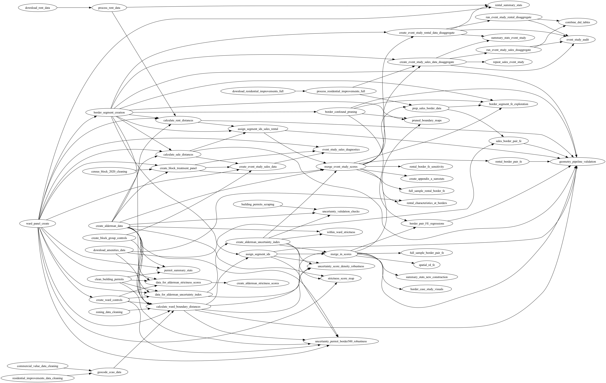

# Aldermanic Privilege

This repository contains code and data pipelines for analyzing the effects of aldermanic discretion on housing development in Chicago.

## Code Organization

The workflow is organized as a series of tasks. Each task folder contains three folders: `input`, `code`, `output`. A task's output is used as an input by one or more downstream tasks. This graph depicts the input-output relationships between tasks:

We use the `make` utility to automate this workflow. Each task is run by calling `make` from its `code/` subdirectory. The paper is compiled by running `make` in `paper/`.

## Project Structure

All raw data lives in `data_raw/` (not tracked in git). Analysis tasks are in `tasks/`, each with its own `code/`, `input/`, and `output/` subfolders. The LaTeX paper is in `paper/` and slides are in `slides/`.

Intermediate outputs are generated by tasks and symbolically linked to downstream task inputs via Makefiles. Each task is run by calling `make` from its `code/` subdirectory. The paper is compiled by running `make` in `paper/`.

## Raw Data Sources

The following files are required in `data_raw/`:

**Ward Boundaries:** `ward1998.shp`, `Wards_2014.geojson`, `Wards_2015.geojson`, `Wards_2024.geojson`

**Cook County Assessor Data:** `Assessor_-_Parcel_Universe__Current_Year_Only__20251004.csv`, `Assessor_-_Parcel_Sales_20251123.csv`, `Assessor_-_Parcel_Proximity_20251007.csv`, `Assessor_-_Single_and_Multi-Family_Improvement_Characteristics_20251111.csv`, `Assessor_-_Commercial_Valuation_Data_20251120.csv`

**Building Permits:** `Building_Permits_20251121.csv`

**Geographic Boundaries:** `Boundaries_-_City_20250920.geojson`, `Boundaries_-_Community_Areas_20250920.geojson`, `Boundaries_-_Zoning_Districts_20250910.geojson`, `zoning-code-summary-district-types.csv`, `illinois-250919-free/` (OSM water areas)

**Census Data:** `CensusBlockTIGER2010_20250721.csv`, `tl_2025_17_tabblock20.shp` (2020 blocks)

**Amenities:** `cta_stations.geojson`, `Major_Streets.shp`, `CPD_Facilities_20250925.geojson`, `CPS_School_Locations_SY1415_20250925.geojson`

## Pipeline 1: Alderman Strictness Scores

Creates an alderman-level strictness index from building permit processing times.

**Foundation tasks** (can run in any order): `ward_panel_create` produces `ward_panel.gpkg`. `clean_building_permits` produces `building_permits_clean.gpkg`. `create_alderman_data` produces `chicago_alderman_panel.csv`.

**Intermediate tasks** (run in order): `create_ward_controls` produces `ward_controls_2000_2023.csv` and `block_group_controls_2000_2023.csv`. Then `data_for_alderman_strictness_scores` produces `ward_monthly_panel_for_alderman_fe.csv` and `alderman_restrictiveness_scores_data.csv`.

**Final tasks:** `create_alderman_strictness_scores` produces `alderman_restrictiveness_scores_month_FEs.csv` and the strictness bar chart (Figure 1). `strictness_score_map` produces the ward map colored by strictness (Figure 2).

## Pipeline 2: Spatial Regression Discontinuity

Estimates density discontinuities at ward boundaries.

**Foundation tasks** (can run in any order): `ward_panel_create`, `create_alderman_data`, `residential_improvements_data_cleaning` (produces `residential_cross_section.csv`), `commercial_value_data_cleaning` (produces `multifamily_data_cleaned.csv`), `zoning_data_cleaning` (produces `zoning_data_clean.gpkg`), `create_block_group_controls` (produces `block_group_controls.csv`), `download_amenities_data` (produces `cta_stops.gpkg`, `major_streets.gpkg`, `parks.gpkg`, `schools_2015.gpkg`).

**Intermediate tasks:** `geocode_ccao_data` produces `geocoded_residential_data.gpkg`. This task also requires the strictness scores from Pipeline 1. Then `calculate_ward_boundary_distances` produces `parcels_with_ward_distances.csv` and `parcels_with_geometry.gpkg`.

**Final analysis tasks** (can run in parallel): `spatial_rd_same_zone_only` produces RD plots (Figures 3-4). `border_pair_FE_regressions` produces `fe_table_bw250.tex` (Table 2) and `fe_table_bw1000.tex` (Table B.1). `summary_stats_new_construction` produces `summary_stats.tex` (Table 1).

**Robustness tasks:** `spatial_rd_same_zone_only_donut` produces donut RD plots (Figure B.1). `spatial_rd_same_zone_only_function_robustness` produces polynomial robustness plots (Figure B.2). `spatial_rd_same_zone_only_placebo_boundaries` produces placebo boundary plots (Figure B.3). `border_pair_FE_regressions_validation` produces balance tables (Table B.2). `border_pair_FE_regressions_donut` produces donut FE tables (Tables B.3-B.4).

## Pipeline 3: Event Study (Home Sales)

Estimates effects of alderman changes on home prices using 2015 and 2023 redistrictings.

**Foundation tasks:** `ward_panel_create`, `create_alderman_data`, `create_block_group_controls`, `census_block_2020_cleaning` (produces `census_blocks_2020.csv`), `process_residential_improvements_full` (produces `residential_improvements_panel.parquet`).

**Intermediate tasks:** Requires strictness scores from Pipeline 1. `calculate_sale_distances` produces `sales_with_ward_distances.csv`. `create_block_treatment_panel` produces `block_treatment_panel.csv`.

**Data creation:** `create_event_study_sales_data_disaggregate` produces `sales_transaction_panel.parquet`, `sales_transaction_panel_2012.parquet`, `sales_transaction_panel_2015.parquet`, and `sales_transaction_panel_announcement.parquet`.

**Final tasks:** `run_event_study_sales_disaggregate` produces event study plots (Figure 6) and `did_table_sales.tex` (Table 4). `event_study_sales_diagnostics` produces identification maps (Figure 5).

## Pipeline 4: Event Study (Rentals)

Estimates effects of alderman changes on rental prices.

**Data download:** `download_rent_data` downloads rental listings to parquet files. `process_rent_data` produces `chicago_rent_panel.parquet`.

**Intermediate tasks:** Requires strictness scores and ward controls from Pipeline 1. `calculate_rent_distances` produces `rent_with_ward_distances_full.parquet`. Uses `block_treatment_panel.csv` from Pipeline 3.

**Data creation:** `create_event_study_rental_data_disaggregate` produces `rental_listing_panel.parquet`, `rental_listing_panel_2015.parquet`, and `rental_listing_panel_2023.parquet`.

**Final tasks:** `run_event_study_rental_disaggregate` produces event study plots (Figure 7) and `did_table_rental.tex` (Table 5). `create_appendix_a_sumstats` produces `rental_sumstats_table.tex` (Table A.1).

## Summary Statistics

`summary_stats_new_construction` uses `parcels_with_ward_distances.csv` to produce Table 1.

`summary_stats_event_study` uses `sales_transaction_panel_2012.parquet` and `rental_listing_panel.parquet` to produce Table 3.

`create_appendix_a_sumstats` uses `rent_with_ward_distances_full.parquet` to produce Table A.1.

## Paper Outputs Reference

| Task | Output File | Paper Location |
|------|-------------|----------------|
| `create_alderman_strictness_scores` | `Month_FEs_final_strictness_index.pdf` | Figure 1 |
| `strictness_score_map` | `strictness_score_map_2025-01.pdf` | Figure 2 |
| `spatial_rd_same_zone_only` | `rd_plot_log_density_*.pdf` | Figures 3-4 |
| `event_study_sales_diagnostics` | `ward_pair_before_after_*.pdf`, `treatment_control_map_*.pdf` | Figure 5 |
| `run_event_study_sales_disaggregate` | `event_study_disaggregate_*.pdf` | Figure 6 |
| `run_event_study_rental_disaggregate` | `event_study_disaggregate_*.pdf` | Figure 7 |
| `summary_stats_new_construction` | `summary_stats.tex` | Table 1 |
| `border_pair_FE_regressions` | `fe_table_bw250.tex` | Table 2 |
| `summary_stats_event_study` | `summary_stats_event_study.tex` | Table 3 |
| `run_event_study_sales_disaggregate` | `did_table_sales.tex` | Table 4 |
| `run_event_study_rental_disaggregate` | `did_table_rental.tex` | Table 5 |
| `create_appendix_a_sumstats` | `rental_sumstats_table.tex` | Table A.1 |
| `border_pair_FE_regressions` | `fe_table_bw1000.tex` | Table B.1 |
| `border_pair_FE_regressions_validation` | `fe_validation_table_bw250_panel_*.tex` | Table B.2 |
| `border_pair_FE_regressions_donut` | `fe_table_bw250_donut*.tex` | Tables B.3-B.4 |
| `spatial_rd_same_zone_only_donut` | `rd_plot_*_donut*.pdf` | Figure B.1 |
| `spatial_rd_same_zone_only_function_robustness` | `rd_*_p*.pdf` | Figure B.2 |
| `spatial_rd_same_zone_only_placebo_boundaries` | `placebo_rd_*.pdf` | Figure B.3 |
| `run_event_study_sales_disaggregate` | `event_study_quarterly_*.pdf` | Appendix C |
| `run_event_study_rental_disaggregate` | `event_study_quarterly_*.pdf` | Appendix C |
