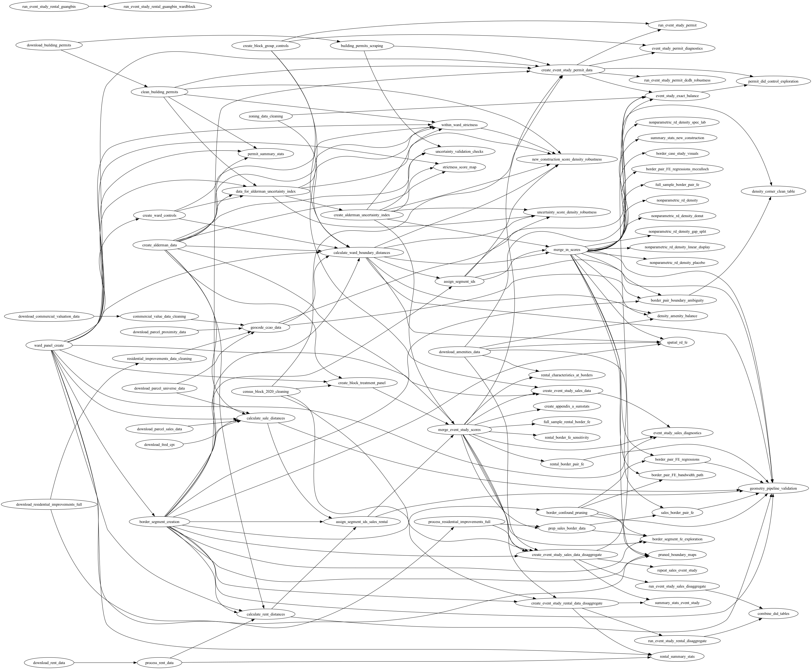

# Aldermanic Privilege

This repository contains the code underlying a paper and slide deck on aldermanic discretion, housing supply, rents, and home prices in Chicago. The current workflow builds a regulatory stringency index from permit processing times, merges that index into canonical border geometry, and estimates density, rental, and home-sales results at ward boundaries.

The project uses a task-based workflow. Each active task lives in `tasks/<task>/` and contains `input/`, `code/`, and `output/` folders.

## Code Organization

The workflow is organized as a series of tasks whose outputs feed downstream tasks through explicit symlinks. Each task is run from its own `code/` folder with `make`, and the task graph is generated directly from those `../input <- ../../upstream/output` dependency rules.

Task graph: [tasks/symlink_graph/output/task_flow.png](tasks/symlink_graph/output/task_flow.png)



## Replication Notes

The project is implemented through task-level Makefiles, R scripts, shell scripts, and symbolic links. Raw source data live in `data_raw/` and are not tracked in git.

Run a task from its own `code/` folder:

```bash
cd tasks/<task>/code
make
```

Build the paper:

```bash
cd paper
make
```

Build the slides:

```bash
cd slides
make
```

Rebuild the task graph:

```bash
cd tasks/symlink_graph/code
make
```
