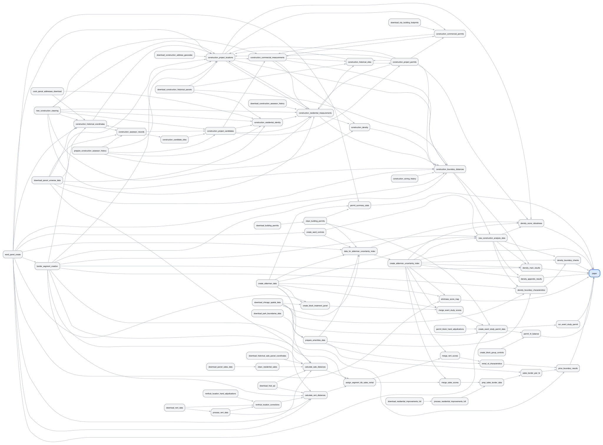

# Aldermanic Privilege

This repository contains the code and data needed to reproduce the paper's
analysis of aldermanic discretion, housing supply, rents, and home prices in
Chicago. The paper measures differences in alderman stringency using permit
processing times and compares outcomes across ward boundaries.

Each task lives in `tasks/<task>/` and has its own `code/`, `input/`, and
`output/` folders. Makefiles connect tasks through explicit file dependencies.
Running `make` at the repository root follows those dependencies through to the
paper.

## Task Graph

The graph shows every data task required by `paper/Makefile`. Arrows point from
a task to the next task that uses its output. Research checks, old
specifications, rezoning work, and slides are not part of the paper build.

[](task_graph/paper_task_flow.svg)

The graph contains no cycles. Shared R package setup and helper files are used
throughout but are omitted from the figure because they do not produce data
outputs.

## Data Inputs

The paper uses two kinds of inputs:

- **Files committed to the repository.** These include the 2014 and 2015 ward
  maps, the final new-construction analysis file, the location characteristics
  used for the density boundary checks, small spreadsheets containing
  hand-reviewed coordinate and block-assignment decisions, and the water layer
  from the September 19, 2025 Geofabrik Illinois OpenStreetMap extract. The
  paper build checks the OpenStreetMap files against
  `data_raw/illinois-250919-free.sha256`.
- **Live downloads.** The build downloads Chicago building permits and spatial
  data, Census ACS data, Cook County assessor and sales data, park boundaries,
  FRED CPI data, and RentHub listings from Dewey. Public agencies can revise
  historical records. A later download may therefore differ from the data
  available when the paper was submitted.

The Census downloads require `CENSUS_API_KEY`, and the RentHub download
requires `DEWEY_API_KEY`. Replicators need their own credentials for both
services. Interrupted RentHub downloads can be resumed by running `make`
again. If a live source is temporarily unavailable, rerun `make` after the
service returns.

## Reproduce the Paper

The build requires R, GNU Make, Bash, Python 3, `curl`, `unzip`, and a LaTeX
installation providing `pdflatex` and `bibtex`. The machine must also have the
system libraries required by the R packages `sf`, `units`, and `arrow`. The
clean replication was tested with R 4.5.2, GNU Make 3.81, Python 3.13.6, and
TeX Live 2024 on macOS.

Install the required R packages:

```bash
cd tasks/setup_environment/code
make
```

Set `CENSUS_API_KEY` and `DEWEY_API_KEY`, and run:

```bash
make
```

The command downloads the public inputs, rebuilds the analysis, and writes the
manuscript to `paper/paper.pdf`. If a download is interrupted, run `make`
again. Completed files are retained, and Make resumes from the first missing or
out-of-date input. Individual tasks can also be run from their `code/`
folders.

### Observed Running Time

A clean run from a fresh clone on July 30, 2026 took **1 hour,
34 minutes, and 43 seconds** on a 15-core Apple M5 Pro MacBook Pro with 24 GB
of memory, after the required software and R packages were installed. The
RentHub download took about 33 minutes, the remaining rental steps took about
14 minutes, and the Cook County sales and property-data branch took about 27
minutes. The permit, score, density, and permit-event-study tasks together took
about 20 minutes. Download times will vary with the external services and the
network connection; these figures report one complete run rather than a
promised range.

## Research Archive

The `main` branch contains only the data and code needed to reproduce the
paper. Audits, exploratory specifications, rezoning work, old analyses, and
presentation files are preserved on the
[`research-archive`](https://github.com/JacobHerbstman/aldermanic_privilege/tree/research-archive)
branch. To recover one of those files without switching branches, use:

```bash
git restore --source research-archive -- path/to/file
```
