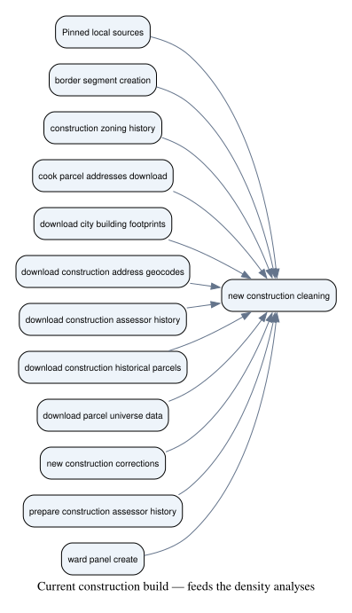

# Aldermanic Privilege

This repository contains the code and data needed to reproduce the paper's
analysis of aldermanic discretion, housing supply, rents, and home prices in
Chicago. The paper measures differences in alderman stringency using permit
processing times and compares outcomes across ward boundaries.

Each task lives in `tasks/<task>/` and has its own `code/`, `input/`, and
`output/` folders. Makefiles connect tasks through explicit file dependencies.
Running `make` at the repository root follows those dependencies through to the
paper.

Data-producing R scripts write their standard reports when they save data,
using `SaveData` in `tasks/shared/code/save_data.R`. Production Makefiles name
datasets and exhibits as targets. Reports accompany those files in `report/`;
deleting a report alone does not rerun its data producer.

The density analyses now use the chronological construction pipeline on this
branch. See the [construction workflow](tasks/new_construction_cleaning/README.md)
for the source-to-project logic and the preserved-history limitations.
The [recorded construction decisions](tasks/new_construction_corrections/README.md)
are committed CSV inputs in a separate task with no R scripts.
Before the first build, run `make -C replication` to obtain the exact recorded
source inputs from the [source release](https://github.com/JacobHerbstman/aldermanic_privilege/releases/tag/recorded-sources-2026-09-10).
The source archive supplements Git; a code-only clone does not contain every input.

## Task Graph

The graph shows every data task required by `paper/Makefile`. Arrows point from
a task to the next task that uses its output. Research checks, old
specifications, rezoning work, and slides are not part of the paper build.

[](task_graph/paper_task_flow.svg)

The graph contains no cycles. Shared R package setup and helper files are used
throughout but are omitted from the figure because they do not produce data
outputs.

The diagram is generated from the paper and task Makefile prerequisites. After
changing dependencies, rebuild it with `make -C task_graph` (requires Graphviz).

## Construction data

The construction build feeds the density analysis tasks in the graph above.
This diagram shows the source tasks that hand files directly
to construction cleaning; it does not depict every upstream download dependency.

[](task_graph/construction_tasks.svg)

Read the [cleaning rules and chronological guide](tasks/new_construction_cleaning/README.md),
the [exact script progression](task_graph/construction_steps.md), or the
[full diagram within construction cleaning](task_graph/construction_scripts.svg).
Both construction diagrams and the script progression are generated from the
current default Make targets. Superseded assembly code is preserved in Git
history and is not part of the current checkout.

## Data Inputs

The paper uses two kinds of inputs:

- **Files committed to the repository.** These include the 2014 and 2015 ward
  maps, small spreadsheets containing
  hand-reviewed coordinate and block-assignment decisions, and the water layer
  from the September 19, 2025 Geofabrik Illinois OpenStreetMap extract. The
  paper build checks the OpenStreetMap files against
  `data_raw/illinois-250919-free.sha256`.
  Recorded Census counts and geography, major streets, sale-parcel coordinates,
  and completed construction-review parcel searches are stored in their source
  tasks. The Census and coordinate archives decompress to the original saved bytes.
- **Live downloads.** The build downloads Chicago building permits and spatial
  data, Cook County assessor and sales data, park boundaries,
  FRED CPI data, and RentHub listings from Dewey. Public agencies can revise
  historical records. A later download may therefore differ from the data
  available when the paper was submitted.

RentHub acquisition requires the replicator's `DEWEY_API_KEY`. A deliberate
refresh of the recorded Census inputs requires `CENSUS_API_KEY`; ordinary builds
reuse the committed Census sources. Interrupted RentHub downloads can be resumed by running `make`
again. If a live source is temporarily unavailable, rerun `make` after the
service returns.

## Reproduce the Paper

The build requires R, GNU Make, Bash, Python 3, `curl`, `unzip`, and a LaTeX
installation providing `pdflatex` and `bibtex`, plus `wget`, `tar`, `gzip`, and `shasum`. The machine must also have the
system libraries required by the R packages `sf`, `units`, and `arrow`. The
clean replication was tested with R 4.5.2, GNU Make 3.81, Python 3.13.6, and
TeX Live 2024 on macOS.

Install the required R packages:

```bash
make -C tasks/setup_environment/code
```

From the repository root, set `DEWEY_API_KEY` for RentHub acquisition, and run:

```bash
make -C replication
make -C paper
```

The command downloads the public inputs, rebuilds the analysis, and writes the
manuscript to `paper/paper.pdf`. If a download is interrupted, run `make`
again. Completed files are retained, and Make resumes from the first missing or
out-of-date input. Individual tasks can also be run from their `code/`
folders against prepared upstream inputs. `make -C paper` is the end-to-end
freshness check: shared Make rules check each concrete upstream product before
its consumer. Run one build at a time in a checkout. The supported Make 3.81
workflow serializes task execution; separate concurrent Make processes can still
write the same outputs.

Settings live in the task Makefile that consumes them. Only execution settings
and the common upstream rule are shared includes. For a script that produces
several fixed files, a multiple-target pattern rule groups those products using
the `output` directory as its stem. This is supported by GNU Make 3.81 and
recovers a missing member without existence-only checks or stamp files.

### Observed Running Time

The September 10, 2026 fresh-clone test of `conference-replication` at
`da074ae3` completed setup, recorded-source acquisition, and the full paper build
in **2 hours, 23 minutes, and 55 seconds** on the macOS environment described
above. It used a new empty Census geography cache, downloaded its own inputs,
and required no patches or manual intervention. Required software and access
credentials were already available. All four paper PDFs compiled, and an
unchanged second paper build ran no analysis or document compiler. See
[`replication/README.md`](replication/README.md) for the source-vintage limits
and the distinction between successful compilation and updating manuscript prose.

For the earlier July pipeline, a clean run from a fresh clone on July 30, 2026 took **1 hour,
34 minutes, and 43 seconds** on a 15-core Apple M5 Pro MacBook Pro with 24 GB
of memory, after the required software and R packages were installed. The
RentHub download took about 33 minutes, the remaining rental steps took about
14 minutes, and the Cook County sales and property-data branch took about 27
minutes. The permit, score, density, and permit-event-study tasks together took
about 20 minutes. Download times will vary with the external services and the
network connection; these figures report one complete run rather than a
promised range. They do not measure the expanded construction rebuild on this branch.

## Research Archive

The `main` branch contains only the data and code needed to reproduce the
paper. Audits, exploratory specifications, rezoning work, old analyses, and
presentation files are preserved on the
[`research-archive`](https://github.com/JacobHerbstman/aldermanic_privilege/tree/research-archive)
branch. To recover one of those files without switching branches, use:

```bash
git restore --source research-archive -- path/to/file
```
