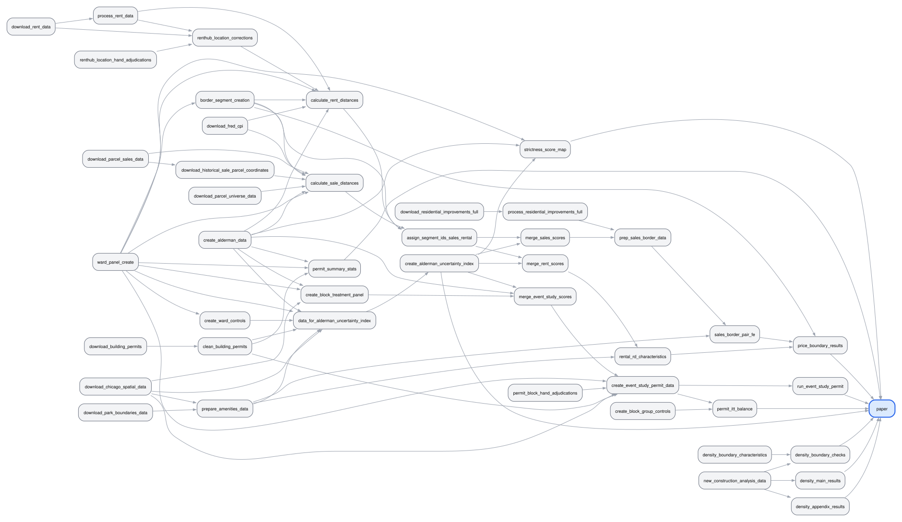

# Aldermanic Privilege

This repository contains the code for a paper on aldermanic discretion, housing
supply, rents, and home prices in Chicago. The analysis estimates alderman
stringency from permit processing times and studies outcomes near ward
boundaries.

Each task lives in `tasks/<task>/` and has its own `code/`, `input/`, and
`output/` folders. Makefiles connect tasks through explicit file dependencies.
Running `make` at the repository root follows those dependencies through to the
paper.

## Paper Task Graph

The graph shows the data tasks required by `paper/Makefile`. Arrows point from
an upstream task to the task that uses its output. Research checks, old
specifications, rezoning work, and slides are not part of this graph.

[](docs/paper_task_flow.svg)

The graph contains no cycles. Shared R package setup and helper files are used
throughout but are omitted from the figure because they do not produce data
outputs.

## Data Inputs

The paper uses three kinds of inputs:

- **Files committed to the repository.** These include two ward-boundary
  files, the final new-construction analysis file, the boundary characteristics
  used for the density continuity checks, small files containing hand-reviewed
  coordinate and block-assignment decisions, and the water layer from the
  September 19, 2025 Geofabrik Illinois OpenStreetMap extract. The paper build
  checks the OpenStreetMap files against
  `data_raw/illinois-250919-free.sha256`.
- **Live downloads.** The build downloads Chicago building permits and spatial
  data, Census ACS data, Cook County assessor and sales data, park boundaries,
  FRED CPI data, and RentHub listings from Dewey. Public agencies can revise
  historical records, so exact last-decimal equality requires the same source
  snapshots used for the submitted paper.

The Census downloads require `CENSUS_API_KEY`, and the RentHub download
requires `DEWEY_API_KEY`. Replicators need their own credentials for both
services. Interrupted RentHub downloads can be resumed by running `make`
again.

## Build

The build requires R, GNU Make, Bash, Python 3, `curl`, `unzip`, and a LaTeX
installation providing `pdflatex` and `bibtex`. The machine must also have the
system libraries required by the R packages `sf`, `units`, and `arrow`.

Install the required R packages:

```bash
cd tasks/setup_environment/code
make
```

Set `CENSUS_API_KEY` and `DEWEY_API_KEY`, and run:

```bash
make
```

Individual tasks can also be run from their `code/` folders.

## Replication Archive

The research repository retains checks and analyses that are not needed to
reproduce the paper. `.gitattributes` excludes those folders from the paper
replication archive. Create the archive from a committed revision with:

```bash
git archive --format=tar.gz --prefix=aldermanic_privilege/ \
  -o aldermanic_privilege_replication.tar.gz HEAD
```
